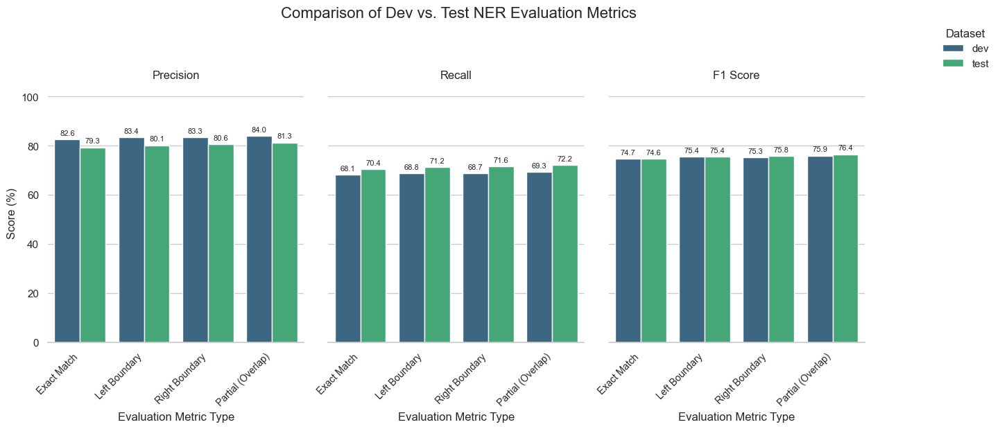
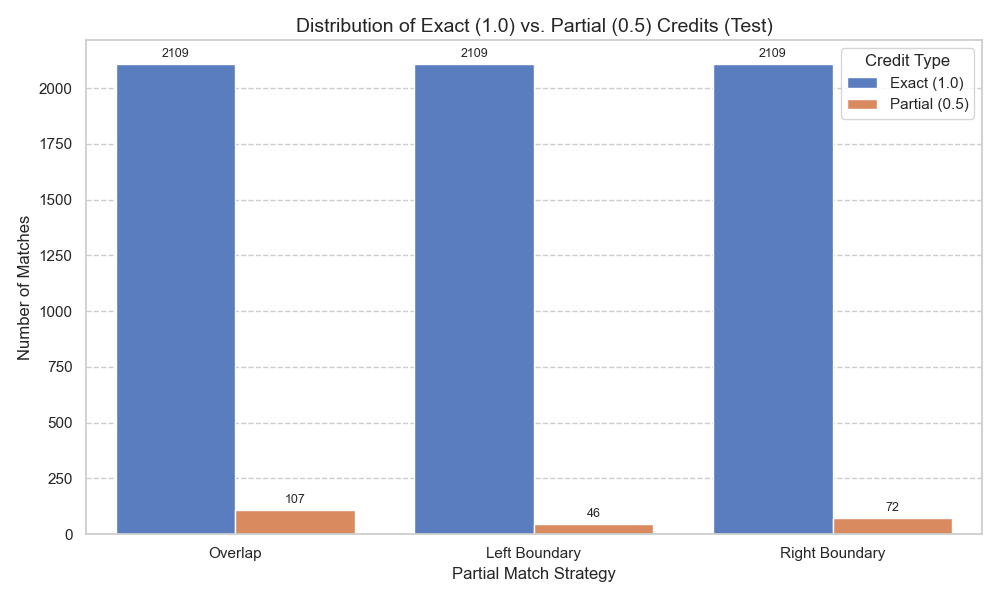

# Partial Evaluation Metrics for Named Entity Recognition

**Authors:** Charles Sullivan and James Kong

[Link to ACL Paper](./Partial%20Evaluation%20Metrics%20in%20Named%20Entity%20Recognition%20-%20James%20Kong%20%20Charles%20Sullivan.pdf)

## Implemented Evaluation Metrics

The following metrics are implemented in `scorer.py`:

-   **Exact Match:** Requires exact match of entity type and character span boundaries.
-   **Exact Boundary Match:** Requires exact match of character span boundaries, ignoring entity type.
-   **Left Boundary Match:** Requires match of the starting character boundary and entity type, ignoring the end boundary. Awards partial credit (0.5) if only the left boundary matches, full credit (1.0) if it's an exact match.
-   **Right Boundary Match:** Requires match of the ending character boundary and entity type, ignoring the start boundary. Awards partial credit (0.5) if only the right boundary matches, full credit (1.0) if it's an exact match.
-   **Partial (Overlap) Match:** Requires any overlap between the predicted and reference character spans *and* a matching entity type. Awards partial credit (0.5) for overlap, full credit (1.0) for an exact match.
    -   A gold mention can match at most one prediction (either exactly or partially).
    -   A prediction can match at most one gold mention (either exactly or partially).

See [`guidelines.md`](guidelines.md) for a discussion on the rationale and quality assessment of partial matches.

## Motivation

Named Entity Recognition (NER) evaluation currently sits between two extremes:
-   **Token-level F1**: Too lenient - identifying just one token (e.g., "New" in "New York") doesn't capture the complete entity.
-   **Exact phrase-level F1**: Too strict - requires perfect boundary and type matching, creating both false positives and negatives for minor boundary differences.

Consider these examples:
-   Gold: "The Ohio State University"[ORG] is in "Ohio"[LOC].
-   Prediction: The "Ohio State University"[ORG] is in "Ohio"[LOC].

Or:
-   Gold: "The New York Times"[ORG]
-   Prediction: The "New York Times"[ORG]

These predictions capture the correct entities but are penalized as errors under exact matching. We believe partial credit metrics could be more sensitive to model improvement in some cases

## Project Overview

This project explores evaluation metrics that award partial credit to NER predictions that are close but not exact matches to annotated data. 

1.  Implemented exact and partial evaluation metrics (inspired by SemEval 2013 and other approaches) in `scorer.py`.
2.  Trained BiLSTM-CRF model using FLAIR on the Broad Twitter Corpus.
3.  Evaluated model outputs using the different metrics implemented in `scorer.py` via `analysis.py`.
4.  Generated detailed reports of partial matches (`predictions/`) and visualizations (`charts/`).
5.  Analyzed the quality of partial matches based on defined guidelines ([`guidelines.md`](guidelines.md), [`predictions/README.md`](predictions/README.md)).
6.  Compared partial metrics against baseline exact-match F1.

## Dataset

We use the [Broad Twitter Corpus](https://aclanthology.org/C16-1111.pdf) so that we can study partial matches on noisy data.

**Preprocessing:** The original dataset contains instances where mentions starting with "@" followed immediately by the rest of the entity (e.g., "@" [B-PER], "username" [B-PER]) are tagged as separate entities. The script `broad_twitter_corpus/dataset_correction.py` corrects this by merging such cases into single entities (e.g., "@" [B-PER], "username" [I-PER]) before training and evaluation. The corrected files (`train.txt`, `dev.txt`, `test.txt`) are used by the project.

## Methodology

### Model Implementation (`train.py`)
-   Uses the [FLAIR](https://github.com/flairNLP/flair) library.
-   Employs a `SequenceTagger` model.
-   Utilizes stacked embeddings (`WordEmbeddings('twitter')`, `FlairEmbeddings`).
-   Incorporates a Conditional Random Field (CRF) layer to improve tag sequence validity.
-   Training is performed using `ModelTrainer`.
-   [Model is available here](https://drive.google.com/drive/folders/1QQb_S4BYiYj-8PnHnyQrBSHp8IH7zVIO?usp=sharing)

### Evaluation (`analysis.py`, `scorer.py`)
-   The `analysis.py` script loads the trained model and evaluates it on the dev and test splits.
-   The `scorer.py` module calculates scores for all implemented metrics (Exact, Left, Right, Partial Overlap) by comparing predictions against gold standard annotations.
-   Detailed CSV files listing the specific gold/prediction pairs that received partial credit (0.5) or full credit (1.0) for overlap, left, and right boundary strategies are saved in the `predictions/` directory. See `predictions/README.md` for an analysis of these matches.
-   Summary visualizations comparing the performance across different metrics are generated and saved in the `charts/` directory.

## Results / Visualizations

The following charts summarize the performance of the trained model for the `dev` set vs the `test` set using the different evaluation metrics, generated by `analysis.py`.

**Comparison of NER Evaluation Metrics:**


**Distribution of Exact vs. Partial Credits for Partial Matching Strategies:**


## Dependencies

The project requires Python 3.x and the libraries listed in `requirements.txt`. Key dependencies include:

-   `flair` (and its core dependency `torch`)
-   `pandas`
-   `numpy`
-   `seaborn`
-   `matplotlib`
-   `tqdm`

You can install the required dependencies using pip:
```bash
pip install -r requirements.txt
```

## How to Run

1.  **Prepare Data:** Ensure the corrected Broad Twitter Corpus files (`train.txt`, `dev.txt`, `test.txt`) are present in the `broad_twitter_corpus/` directory. You can generate these using `python broad_twitter_corpus/dataset_correction.py`.
2.  **Install Dependencies:** Set up a virtual environment and install the required packages:
    ```bash
    python -m venv venv
    source venv/bin/activate  
    pip install -r requirements.txt
    ```
3.  **Train Model:** Train the model in Colab using `train.ipynb`.
4.  **Run Analysis:** Execute the analysis script, ensuring the model path in `analysis.py` points to your trained model: `python analysis.py`. This will print scores on to the console, generate CSV files in `predictions/`, and save charts in `charts/` - for both the dev and test sets of the BTC.

## References

-   [SemEval 2013 Task 9.1](https://aclanthology.org/S13-2056.pdf)
-   [Named Entity Recognition Evaluation](https://www.davidsbatista.net/blog/2018/05/09/Named_Entity_Evaluation/)
-   [Biomedical NER](https://link.springer.com/article/10.1186/1471-2105-7-92)
-   [FLAIR Documentation](https://flairnlp.github.io/docs/tutorial-training/how-to-train-sequence-tagger#training-a-named-entity-recognition-ner-model-with-flair-embeddings)